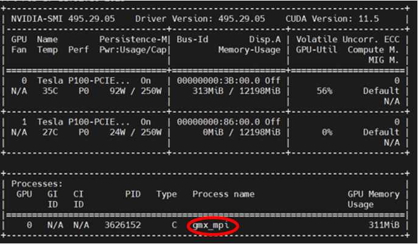

### Options de parallélisme 

Pour obtenir une meuilleure performance de l'application Gromacs ( l'outil mdrun ) , l'utilisateur est invité à consulter la documentation officielle sur : 

https://manual.gromacs.org/documentation/current/user-guide/mdrun-performance.html 

L'utilisateur peut tester plusieurs options de parallelisme  en spécifiant la partition **defq** un **temps de calcul** réduit (15 min par exemple )  : 

```
#SBATCH --partition=defq
#SBATCH --time=0-00:15:00
```

puis comparer l'avancement de chaque configuration  ( nombre de steps atteint , date de fin estimée )  afin  choisir le mode de parallélisme  optimal pour son  calcul  .

## Exemple de mdrun  sur un seul noeud : 

Exemples de specs avec le script [gromacs_1NxMyT.sl](gromacs_1NxMyT.sl)  :

```
#SBATCH --nodes=1
#SBATCH --ntasks-per-node=X
#SBATCH --cpus-per-task=Y
```

le choix de X et Y se traduit en option ntmpi et ntomp de mrdun sur la commande 
```
gmx mdrun -ntmpi $SLURM_TASKS_PER_NODE -ntomp $SLURM_CPUS_PER_TASK -v -deffnm md_0_10
```

| X  | Y  | Commandes                    | 
| ---| ---| -----------------------------| 
| 1  | 32 | gmx mdrun -ntmpi 1 -ntomp 32 |
| 2  | 16 | gmx mdrun -ntmpi 2 -ntomp 16 |
| 4  | 8  | gmx mdrun -ntmpi 4 -ntomp 8  | 
| 8  | 4  | gmx mdrun -ntmpi 8 -ntomp 4  | 

## Exemple de mdrun  sur plusieurs noeuds (MPI) : 

Selon la complexité du probleme a simuler , il se peut que l'utilisateur ai besoin de reserver plusiers noeuds afin d effectuer son calcul . le script  [gromacs_2NxMyT.sl](gromacs_2NxMyT.sl) propose un tel exemple : 

```
#SBATCH --nodes=2
#SBATCH --ntasks-per-node=X
#SBATCH --cpus-per-task=Y
```

le choix de X et Y se traduit en option np et ntomp de mrdun sur la commande 

```
mpirun -np $SLURM_NTASKS gmx_mpi mdrun -ntomp ${SLURM_CPUS_PER_TASK} -v -deffnm md_0_10
```

**NB** :  l'utilisateur est invité à faire des tests pour avoir une estimation sur la performance avant de lancer son job de production  . pour les inputs réduits , l' execution de mdrun sur un seul noeud peut s'averer plus rapide .


## Acceleration GPU : 

le script gromacs_gpu.sl [gromacs_gpu.sl](gromacs_gpu.sl)  les directives SLURM et le module gromacs pour utiliser le carte GPU:  

une fois le job en execution , vérifier le fichier output de gromacs pour confirmer la detection de la carte GPU  

> 1 GPU selected for this run.
Mapping of GPU IDs to the 2 GPU tasks in the 1 rank on this node:
  PP:0,PME:0
PP tasks will do (non-perturbed) short-ranged interactions on the GPU
PP task will update and constrain coordinates on the CPU
PME tasks will do all aspects on the GPU
Using 1 MPI process
Non-default thread affinity set, disabling internal thread affinity
Using 20 OpenMP threads 


confimer  que gromacs s'execute sur la carte GPU à l aide de la commande nvidia-smi lancé au niveau du noeud gpu alloué au Job :

```
ssh <gpu_node> 
nvidia-smi 
```




